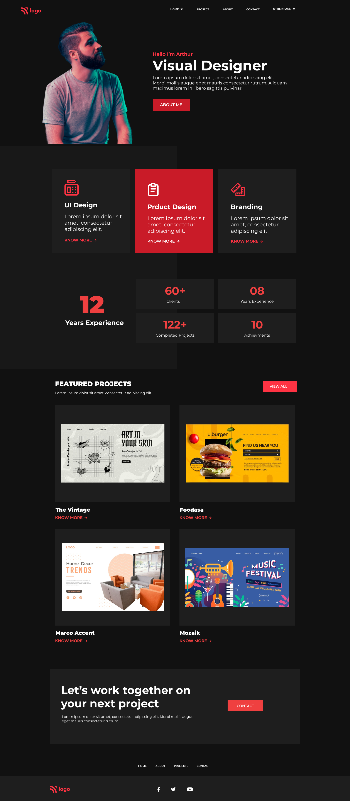

# About
## Product Design LandingPage.
Develop this website completly using HTML and CSS without using media query.

## 🔗Demo Link
https://samhith15.netlify.app/
 

## 📌 Tech Stack

&nbsp;
&nbsp;
 
 

# what i learn't
  👉 **typography**  
  👉 **CSS with less amount of media query**   
  👉 **responsive images**    
  👉 **grid layout**    
  👉 **Advanced layout designing**  
  👉 Units like pixels, viewports,percentage   
  👉 **build a responsive website with redundant code**  
  👉 Less HTML and CSS with beautiful **UI Template**  

## Time taken to complete this project was less than **1 hr**.
 

## 📌 Overview

 

 "completly responsive")

 "Template Screenshot")